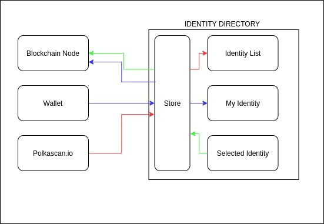

# Identity Hub and Blockchain Node Integration

Identity Hub client app has an option to chose to which blockchain node it will connect. There are predefined options like Polkadot and Kusama offical websockets or a custom one where the user will type in the address of a node. There are also private ones that are running on AWS EC2 instances.

Application uses library [polkadot.js](https://polkadot.js.org/docs/) to establish these connections and everything else needed as fetching user Identity, sending tokens, etc.

# Identity Hub and Polakscan API Integration

The batch fetching of identities is provided by [polkascan's API](https://polkascan.io/)

# Architecture Diagram
