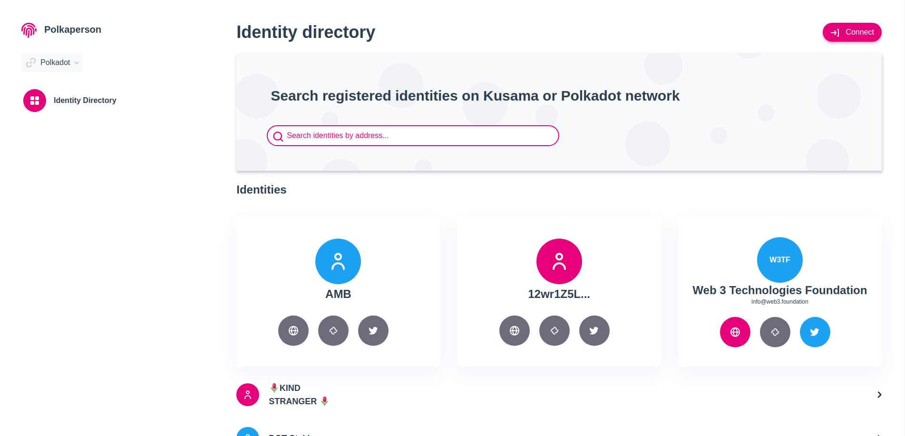
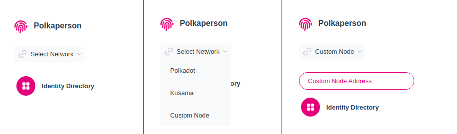
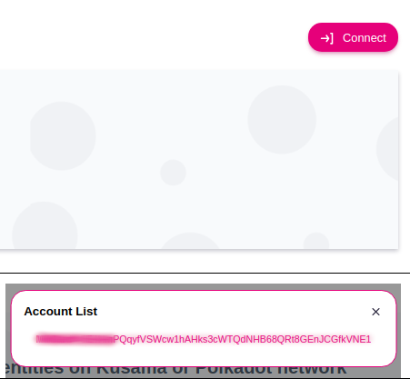
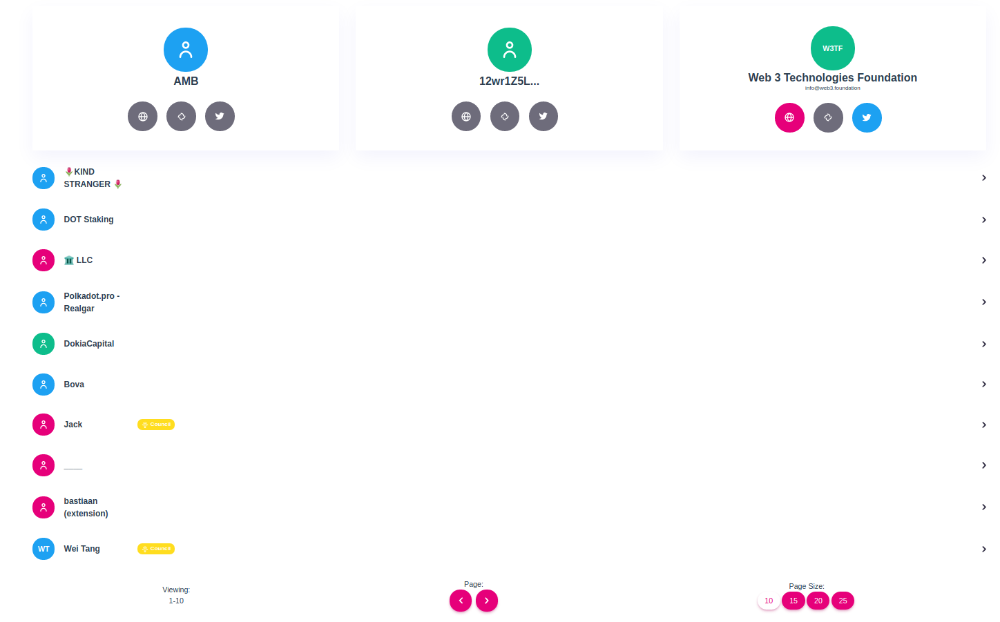
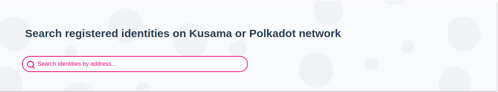
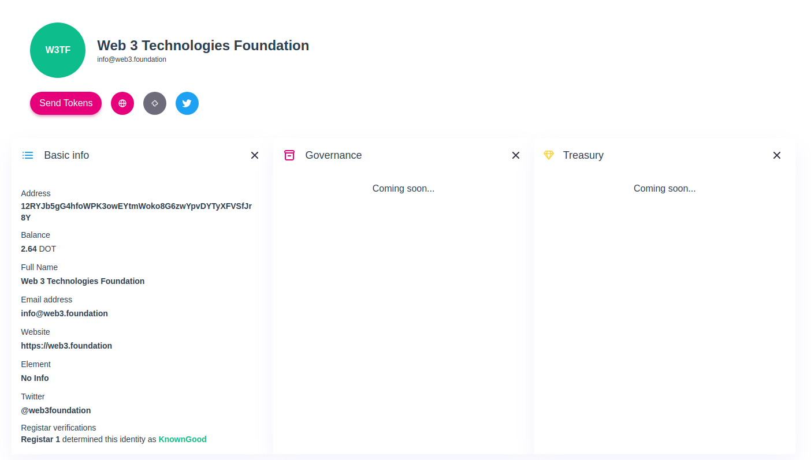
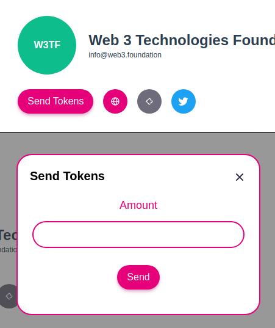

# Identity Directory

## Introduction
Identity Directory is a aplication designed for finding identities, viewing them and sending tokens to them on Polkadot/Kusama blockchains. 

## Content
- [Connecting to the network](#network)
- [Connecting the wallet](#wallet)
- [Browsing the Identities](#browse)
- [Searching for Identity](#search)
- [Viewing Identity](#identity)
- [Making Transactions](#transaction)

###  Connecting to the network 
To connect to the network on the side bar there is a dropdown with label Select Network, when clicking on it few options will appear (Polkadot, Kusama and Custom Node). When selecting Polkadot or Kusama application will automatically connect to the network, but if `custom node` is selected new input will appear and when websocket url is entered it will try to connect to the network. 

###  Connecting the wallet
To connect application to your wallet there is a Connect button in the top right corner. After clicking on it, modal will appear with a list of available wallets. 

### Browsing the Identities 
After connecting to the blockchain, identity table will be filled automatically and from there you can browse the identities. 

*Note: Only Polkadot and Kusama nodes will load the list of identities, custom nodes will not fill the table with data*
### Searching for Identity
After connecting to the blockchain you will be able to search for the identity using address. 

*Note: Full address is needed for the search*
### Viewing Identity
Clicking on the identity on the table or when searching for a valid Identity, you will be redirected to the Identity View page, where you will find more datails about the account. 

###  Making Transactions 
On the identity view page there is a option to send tokens to the account that you are viewing. Affter clicking on the Send Tokens button you will be promted for the amount of tokens that you want to send.  
 

